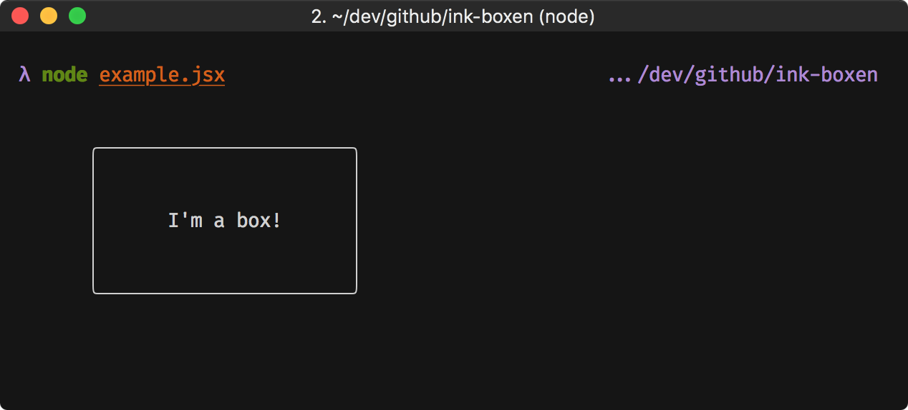

# ink-boxen

> A [boxen](https://github.com/sindresorhus/boxen/) component for [Ink](https://github.com/vadimdemedes/ink/)

[](https://travis-ci.org/yardnsm/ink-boxen)

## Install

```console
$ npm install --save ink-boxen
```

## Example Usage

```javascript
import { h, render } from 'ink';
import Boxen from 'ink-boxen';

render((
  <div>
    <Boxen
      text="I'm a box!"
      padding={2}
      margin={2}
      borderStyle="round"
    />
  </div>
));
```




## API

### `<Boxen />`

The props are simply being passed to `boxen`. You can find all of the available options
in [boxen's README](https://github.com/sindresorhus/boxen#options).

---

## License

MIT © [Yarden Sod-Moriah](http://yardnsm.net/)
